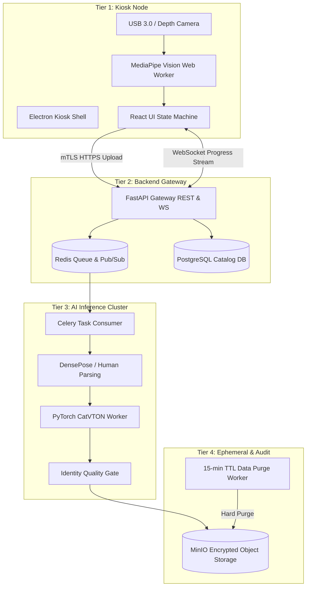

# Live Integration Architecture & Implementation Roadmap
## AURA Virtual Fitting Room Kiosk System

**Document Version:** 1.0  
**Target:** Production Integration & Deployment Plan  
**Date:** October 2026  

---

## 1. Executive Integration Overview

Having completed the **Kiosk Interactive Frontend** (React + TypeScript + Vite + TailwindCSS), the next phase transitions the prototype into a production-grade live ecosystem.

The system will be integrated across four major tiers:
1. **Edge Kiosk Hardware & Shell** (Electron + MediaPipe Web Worker + Camera Interfacing)
2. **Async API Gateway** (FastAPI + Pydantic v2 + WebSockets + mTLS)
3. **Queue & Storage Tier** (Redis + Celery + MinIO Ephemeral Storage + PostgreSQL)
4. **GPU AI Worker Pool** (PyTorch + Hugging Face Diffusers VTON Pipeline + DensePose)

---

## 2. Phase-by-Phase Integration Plan

### Phase 1: Real MediaPipe & Edge Hardware Interfacing
* **Target Duration:** 2 Weeks
* **Key Tasks:**
  1. Install `@mediapipe/tasks-vision` in renderer worker to process live camera frames (`1080p @ 60fps`).
  2. Implement landmark extraction for 33 pose keypoints & 468 face landmarks.
  3. Bind One Euro filter smoothing algorithms to eliminate keypoint jitter during pose stability checks.
  4. Build Electron IPC main process bindings for OS lockdown (Windows Assigned Access / Linux Kiosk), watchdog heartbeat, and local crash recovery.

### Phase 2: FastAPI Backend Core & PostgreSQL Database Setup
* **Target Duration:** 3 Weeks
* **Key Tasks:**
  1. Scaffold `api_gateway/` python codebase with FastAPI async handlers.
  2. Implement OpenAPI `/v1` endpoints:
     * `POST /v1/sessions` (Create session, issue short-lived JWT token & WebSocket URL)
     * `POST /v1/sessions/{id}/captures` (Process still + EXIF removal + validation)
     * `POST /v1/sessions/{id}/tryon` (Submit job, returns job ID)
     * `GET /v1/catalog` (Garment catalog feed)
     * `POST /v1/sessions/{id}/size-recommendation` (Measurement engine integration)
  3. Set up PostgreSQL database migrations with Alembic (`brands`, `garments`, `kiosks`, `sessions`, `audit_events`).
  4. Configure mTLS device certificate validation for kiosks.

### Phase 3: GPU Inference Worker Pool (PyTorch + Diffusers)
* **Target Duration:** 4 Weeks
* **Key Tasks:**
  1. Containerize GPU Worker on NVIDIA Container Toolkit with pinned PyTorch 2.4, CUDA 12.4, and Hugging Face Diffusers.
  2. Implement the `TryOnModel` adapter pattern supporting **CatVTON** and **IDM-VTON**.
  3. Preprocessing module integration:
     * Human parsing model (SCHP) to separate arms, torso, face, and legs.
     * DensePose generator for body surface conditioning.
     * Garment agnostic mask builder.
  4. Optimizations: FP16 PyTorch baseline -> FlashAttention-2 -> UNet model compilation (`torch.compile`).
  5. Automated Quality Gate: Cosine similarity comparison on face identity features between input photo and rendered VTON output.

### Phase 4: Sizing & Measurement Regression Engine
* **Target Duration:** 2 Weeks
* **Key Tasks:**
  1. Integrate 3D body regression model (SMPL/SMPL-X family) to estimate physical circumferences (chest, waist, hip, shoulder width, inseam) from RGB capture + height input.
  2. Implement size chart matching algorithm supporting garment stretch classes (Low, Medium, High) and fit intent (Slim, Regular, Relaxed).
  3. Wire **Honesty Rule alert engine** to detect and highlight fit discrepancies to the shopper.

### Phase 5: Ephemeral Data Protection & Security Hardening
* **Target Duration:** 2 Weeks
* **Key Tasks:**
  1. Configure MinIO / NVMe object storage with bucket lifecycle policies enforcing a **hard 15-minute TTL purge**.
  2. Implement a background reconciliation worker process that continuously verifies and logs zero stale user imagery exists.
  3. Run penetration testing on kiosk escape vectors, API rate limiting, and request size caps.

### Phase 6: End-to-End Validation & Store Pilot
* **Target Duration:** 4 Weeks
* **Key Tasks:**
  1. **Contract Testing:** Validate API schemas between Electron client and FastAPI gateway using OpenAPI specifications.
  2. **Soak Testing:** 72-hour continuous kiosk execution to test memory leaks and Web Worker stability.
  3. **Model Benchmark Suite:** Test 20 garments across 30 diverse body types, skin tones, and fabric textures.
  4. **Field Pilot:** Launch pilot installation in 1 physical store location with 2 brand catalogs.

---

## 3. Technology Integration Matrix

| Integration Point | Interface / Protocol | Schema / Data Contract | Resilience & Failure Mode |
| :--- | :--- | :--- | :--- |
| **Kiosk ↔ Gateway** | HTTPS (REST) / WSS (WebSockets) | OpenAPI v3 JSON / Pydantic v2 | Exponential backoff reconnect, polling GET `/v1/jobs/{id}` fallback. |
| **Gateway ↔ Redis** | TCP / Redis Protocol | Celery Message Format | AOF persistence, late acknowledgments (`acks_late=True`), 30s job TTL. |
| **Worker ↔ GPU** | NVIDIA Container Toolkit | PyTorch Tensors (FP16 VRAM) | Max 1 automatic retry on OOM; worker auto-restart supervisor. |
| **Worker ↔ MinIO** | S3 API | Encrypted JPEGs / PNGs | Hard 15-min lifecycle rule + reconciliation auditor. |

---

## 4. Immediate Recommended Next Sprint Action Items

1. **Backend Repository Scaffolding:** Initialize `backend/` folder in workspace with FastAPI setup, Pydantic v2 models, and Docker Compose environment.
2. **MediaPipe Task Vision Worker Integration:** Update Kiosk frontend Web Worker to process webcam frames via `@mediapipe/tasks-vision` npm library.
3. **Database Schema Setup:** Create PostgreSQL schema migrations for catalog items and telemetry audit events.
